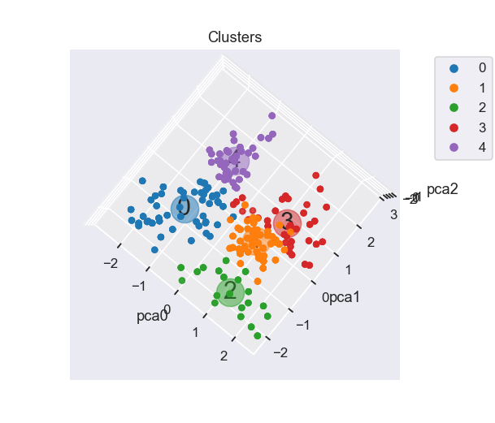
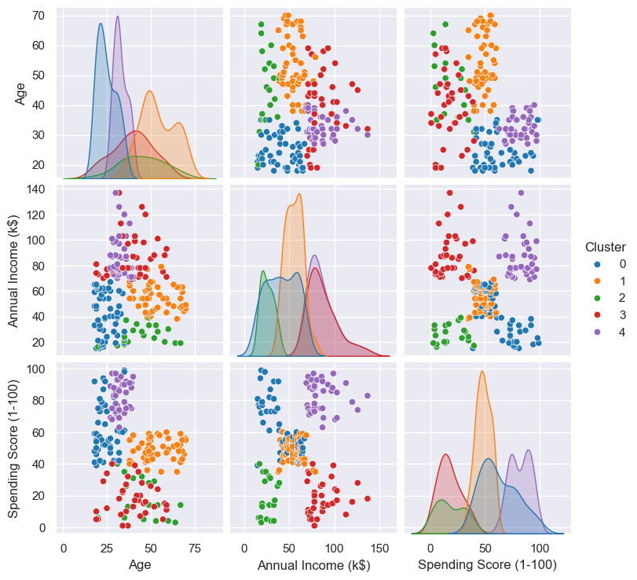

# Segmentação de clientes de um supermercado/*Customer Segmentation for a Supermarket


PT

📌 Visão Geral
A segmentação de clientes com base em parâmetros pré-definidos como gastos com compras, renda anual, idade, sexo ajudam na formulação de estratégias de acordo com o perfil desses clientes. 

Este projeto tem como objetivo segmentar esses clientes de acordo com os parâmetros fornecidos no dataset, usando kmeans, as bibibliotecas scikitlearn, matplotlib, pandas, técnicas de aprendizado não supervisionado de clusterização e  redução de diemnsionalidade

O conjunto de dados contém:
✅ Idade
✅ Gênero
✅ Renda Anual (k$)
✅ Pontuação de Gastos (1-100) (métrica definida pelo supermercado com base no comportamento de compra)

🎯 Objetivo
Identificar grupos de clientes com características semelhantes para auxiliar o supermercado em:

Estratégias de marketing personalizadas

Ofertas direcionadas

Melhorias na experiência do cliente


EN

## **📌 Overview**  
This project aims to segment supermarket customers based on demographic and behavioral data using **unsupervised machine learning (K-Means Clustering)**.  

The dataset includes:  
✅ **Age**  
✅ **Gender**  
✅ **Annual Income (k$)**  
✅ **Spending Score (1-100)** *(a metric defined by the supermarket based on shopping behavior)*  

🔗 **Original Dataset:** [Mall Customer Segmentation Data | Kaggle](https://www.kaggle.com/vjchoudhary7/customer-segmentation-tutorial-in-python)  

---

## **🎯 Goal**  
Identify customer groups with similar traits to help the supermarket with:  
- **Personalized marketing strategies**  
- **Targeted promotions**  
- **Improved customer experience**  

---

## Detalhes do dataset utilizado e resumo dos resultados

🔍 Análise Exploratória (EDA)
Foram realizadas análises estatísticas e visualizações para entender a distribuição dos dados

📊 Visualizações Principais
Pairplot, histogramas, boxplots, matriz de correlação


⚙️ Pré-processamento
Foram aplicadas as seguintes transformações:

One-Hot Encoding para a variável categórica (Gender).

PowerTransformer para normalizar as variáveis numéricas (Age, Annual Income, Spending Score).


🤖 Modelagem (K-Means Clustering)

📌 Segmentação dos Clientes
Pontuação de gastos | Renda | Idade | Número Cluster
--- | --- | --- | ---
Altos | Moderada | Jovens | 0
Baixos | Baixo | Moderada | 1
Altos | Alta | Jovens Adultos | 2
Baixos | Alta | Moderada | 3
Moderados | Moderado | Alta | 4


📊 Visualização 3D com PCA
Para melhor visualização, reduzi a dimensionalidade usando PCA (3 componentes).


📌 Conclusões

O EDA revelou padrões fundamentais sobre o comportamento dos clientes:

Distribuições:

A base é equilibrada em gênero (56% mulheres, 44% homens).

Spending Score e Annual Income têm distribuições amplas, ideais para segmentação.

Correlação negativa entre Age e Spending Score (-0.34): clientes mais jovens tendem a gastar mais.

Segmentação Inicial:

O pairplot mostrou potencial para agrupamentos naturais, especialmente nas relações entre renda e gastos.

Boxplots por gênero indicaram que homens jovens têm maior dispersão nos gastos.


O modelo identificou 5 clusters com perfis distintos:

Cluster 2 (19.5%): Alto potencial (alta renda + alto gasto) → Priorizar campanhas premium.

Cluster 4 (26.5%): Renda e gastos moderados + idade alta → Oferecer produtos de valor intermediário.

Cluster 1 (10%): Baixa renda e gastos → Evitar investimentos pesados.

Validação:

Silhouette score e método elbow confirmaram que 5 clusters equilibram granularidade e interpretabilidade.

Diferenças por gênero foram observadas (ex.: Cluster 0 com 60% mulheres).

Aplicação:

Essa segmentação permite personalizar estratégias de marketing e otimizar alocação de recursos.


A redução de dimensionalidade com PCA permitiu:

Visualização eficiente: Os 3 componentes principais capturaram a essência dos dados (sugerido pela variância explicada).

Confirmação dos clusters: A projeção 3D mostrou grupos bem separados, validando a escolha de 5 clusters.


Vantagens:

A técnica simplificou a comunicação dos resultados para stakeholders não técnicos.

Facilitou a identificação de outliers e sobreposições entre clusters.

Recomendação final:
Combinar as análises dos 3 notebooks permite criar personas de clientes e desenvolver estratégias baseadas em dados concretos.

Link original para o dataset: https://www.kaggle.com/vjchoudhary7/customer-segmentation-tutorial-in-python
[Link original para o dataset](https://www.kaggle.com/vjchoudhary7/customer-segmentation-tutorial-in-python)


EN

 ## **🔍 Exploratory Data Analysis (EDA)**  
Statistical and visual analyses were performed to understand data distribution:  

### **📊 Key Visualizations**  
1. **Pairplot (Variable Relationships)**  

   sns.pairplot(df_analise, diag_kind='kde', hue='Gender')
Histograms & Boxplots


⚙️ Preprocessing
Applied transformations:

One-Hot Encoding for categorical data (Gender).

PowerTransformer for numerical features (Age, Income, Spending Score).


🤖 Modeling (K-Means Clustering)
Pipeline

📌 Customer Segments
Cluster	Spending Score	Income	Age
0	High	Low	Young
1	Low	Low	Middle-aged
2	High	High	Young Adults
3	Low	High	Middle-aged
4	Moderate	Moderate	Elderly

📊 3D Visualization (PCA)
Reduced dimensionality using PCA (3 components):

📌 Conclusions
The EDA revealed key patterns in customer behavior:

Distributions:

The base is balanced in gender (56% women, 44% men).

Spending Score and Annual Income have wide distributions, ideal for segmentation.

Negative correlation between Age and Spending Score (-0.34): younger customers tend to spend more.

Initial Segmentation:

The pairplot showed potential for natural groupings, especially in the relationships between income and spending.

Boxplots by gender indicated that young men have greater dispersion in spending.

The model identified 5 clusters with distinct profiles:

Cluster 2 (19.5%): High potential (high income + high spending) → Prioritize premium campaigns.

Cluster 4 (26.5%): Moderate income and spending + high age → Offer intermediate value products.

Cluster 1 (10%): Low income and expenses → Avoid heavy investments.

Validation:

Silhouette score and elbow method confirmed that 5 clusters balance granularity and interpretability.

Differences by gender were observed (e.g.: Cluster 0 with 60% women).

Application:

This segmentation allows to customize marketing strategies and optimize resource allocation.

Dimensionality reduction with PCA allowed:

Efficient visualization: The 3 principal components captured the essence of the data (suggested by the explained variance).

Confirmation of clusters: The 3D projection showed well-separated groups, validating the choice of 5 clusters.

Advantages:

The technique simplified the communication of results to non-technical stakeholders.

It facilitated the identification of outliers and overlaps between clusters.

Final recommendation:
Combining the analyses from the 3 notebooks allows you to create customer personas and develop strategies based on concrete data.


Versões das bibliotecas:

-------------------- | ----------
     Biblioteca      |   Versão  
-------------------- | ----------
Matplotlib           |      3.9.2
NumPy                |     1.26.4
Pandas               |      2.2.3
Scikit-Learn         |      1.5.1
Seaborn              |     0.13.2

Versão do Python: 3.12.3

## Configuração do ambiente

1. Faça o clone do repositório que será criado a partir deste modelo.

    ```bash
    git clone ENDERECO_DO_REPOSITORIO
    ```

2. Crie um ambiente virtual para o seu projeto utilizando o gerenciador de ambientes de sua preferência.

    a. Caso esteja utilizando o `conda`, exporte as dependências do ambiente para o arquivo `ambiente.yml`:

      ```bash
      conda env export > ambiente.yml
      ```

    b. Caso esteja utilizando outro gerenciador de ambientes, exporte as dependências
    para o arquivo `requirements.txt` ou outro formato de sua preferência. Adicione o
    arquivo ao controle de versão, removendo o arquivo `ambiente.yml`.


Para mais informações sobre como usar Git e GitHub, [clique aqui](https://cienciaprogramada.com.br/2021/09/guia-definitivo-git-github/). Sobre ambientes virtuais, [clique aqui](https://cienciaprogramada.com.br/2020/08/ambiente-virtual-projeto-python/).
